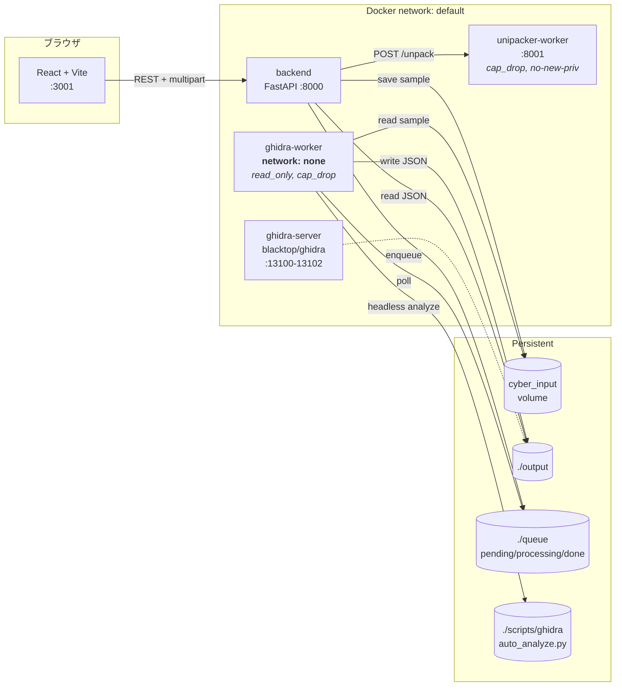
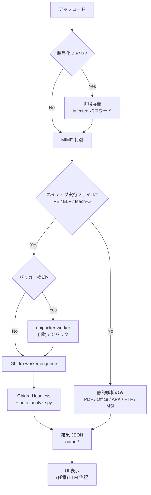

# Cyber Ghidra WebUI

> Docker で完結する **Ghidra ヘッドレス解析 + 静的スキャナー + LLM 関数注釈** のオールインワン WebUI

検体をブラウザにドロップするだけで、自動展開 → アンパッキング → Ghidra 逆コンパイル → 静的多段スキャン → LLM 注釈までを一気通貫で回せる、リバースエンジニアリング作業者向けのローカル解析プラットフォームです。

[](https://fastapi.tiangolo.com/)
[](https://vitejs.dev/)
[](https://ghidra-sre.org/)
[](https://docs.docker.com/compose/)
[]()

---

## 目次

- [できること](#できること)
- [クイックスタート](#クイックスタート)
- [アーキテクチャ](#アーキテクチャ)
- [解析パイプライン](#解析パイプライン)
- [セキュリティモデル](#セキュリティモデル)
- [API リファレンス](#api-リファレンス)
- [環境変数](#環境変数)
- [静的解析スキャナー](#静的解析スキャナー)
- [LLM 関数注釈](#llm-関数注釈)
- [開発](#開発)
- [運用上の注意](#運用上の注意)
- [謝辞](#謝辞)

---

## できること

| 領域 | 内容 |
|---|---|
| **検体投入** | ブラウザに D&D。バッチ複数ファイル投入対応。`infected` パスワード付き ZIP / 7z は自動再帰展開（最大 32 階層） |
| **アンパッキング** | Unipacker による PE 自動アンパック。複数レイヤー対応、ヒューリスティクスでパッカー検知後に起動 |
| **逆コンパイル** | Ghidra 11.3.1 ヘッドレスで関数情報・デコンパイル C・CFG・コールグラフを抽出 |
| **静的解析** | oletools / pdfid / pefile / LIEF / capa / binwalk / androguard を MIME に応じて自動選択。リスクスコアを集約 |
| **LLM 注釈** | OpenAI 互換 API (Ollama / LM Studio) を呼び、関数ごとに目的・suspicious API 解釈を生成 |
| **ジョブ管理** | ファイルシステム ベース キュー + 履歴 UI。再オープン・差分比較・フォントサイズ制御 |
| **GPU 加速** | AMD ROCm (Radeon) / NVIDIA CUDA / CPU の 3 モード切替 (`start.bat`) |

---

## クイックスタート

### 必要環境

- Docker Desktop または Docker Engine + Compose v2
- 推奨 RAM 16GB 以上、ディスク空き 20GB 以上
- (任意) AMD Radeon (ROCm) または NVIDIA GPU + nvidia-container-runtime

### Windows

```cmd
git clone https://github.com/matrix9neonebuchadnezzar2199-sketch/cyber-ghidra-webui.git
cd cyber-ghidra-webui
copy .env.example .env
start.bat
```

`start.bat` は `MAGI` ブートメニューを表示します:

```
1. AMD Radeon Mode    (ROCm + HSA_OVERRIDE_GFX_VERSION=11.0.0)
2. NVIDIA GeForce Mode
3. CPU Only Mode
```

起動後、ブラウザで [http://localhost:3001](http://localhost:3001) を開いてください。

### Linux / WSL2

```bash
git clone https://github.com/matrix9neonebuchadnezzar2199-sketch/cyber-ghidra-webui.git
cd cyber-ghidra-webui
cp .env.example .env

# CPU / NVIDIA
docker compose up -d

# AMD ROCm
docker compose -f docker-compose.yml -f docker-compose.amd.yml up -d
```

### 動作確認

```bash
curl http://localhost:8000/health
# → {"status": "healthy", "ghidra_available": true, ...}
```

---

## アーキテクチャ



### 主要コンポーネント

| サービス | ベース | 役割 |
|---|---|---|
| **frontend** | Vite + React 18 | UI、ジョブ履歴、CFG/コールグラフ可視化 (xyflow + ELK) |
| **backend** | FastAPI 0.109+ | アップロード受付、ルーティング、静的スキャン、LLM 注釈オーケストレーション |
| **ghidra-worker** | Ghidra 11.3.1 + JDK 21 (Temurin) | キュー監視、`analyzeHeadless` + Jython スクリプト実行 |
| **unipacker-worker** | python:3-slim | Unipacker による PE アンパック微小サービス |
| **ghidra-server** | `blacktop/ghidra:latest` | (任意) チーム共同利用のための Ghidra リポジトリサーバー |

### ジョブキュー

ファイルシステム ベースで実装されています:

```
queue/
├── pending/     ← backend がエンキュー
├── processing/  ← worker が atomic mv して処理中
└── done/        ← 完了後にフラグ
```

→ Redis や RabbitMQ への依存ゼロ。**ただしワーカーは 1 インスタンス前提** (詳細: [運用上の注意](#運用上の注意))。

---

## 解析パイプライン

検体は **MIME 自動判別 (libmagic 優先)** で 2 系統にルーティングされます:



| 拡張対象 | 既定の処理 |
|---|---|
| `.exe` / `.dll` / `.sys` (PE) | パッカー検知 → 必要なら unpack → Ghidra |
| ELF / Mach-O | Ghidra 直行 |
| `.pdf` / Office (`.docx`, `.xlsm` 等) | 静的スキャナーのみ (oletools / pdfid) |
| `.apk` / DEX | androguard |
| `.zip` / `.7z` (Office 以外) | 再帰展開して各 entry を再投入 |

---

## セキュリティモデル

研究用ツールのため、**実行可能性を持つ検体を扱う前提**で多段防御を組んでいます。

### 検体の扱い

- **ホスト不可視**: アップロードされた検体は Docker named volume `cyber_input` に保存されます。ホスト FS には現れず、AV の誤検知や誤実行を防ぎます
- **解析後の自動削除**: Ghidra 解析が成功したジョブの検体は `ghidra-worker` が `/app/input` から削除します (失敗時は静的解析用に保持)
- **手動クリア**: `docker volume rm cyber-ghidra-webui-main_cyber_input`

### コンテナハードニング

| サービス | network | filesystem | capabilities | privilege |
|---|---|---|---|---|
| `ghidra-worker` | **none** (隔離) | `read_only`, tmpfs `/tmp` 2GB | `cap_drop: ALL` | `no-new-privileges` |
| `unipacker-worker` | default | tmpfs `/tmp` 2GB | `cap_drop: ALL` | `no-new-privileges` |
| `backend` | default | tmpfs `/tmp/extract` 1GB (`noexec,nosuid,nodev`) | (デフォルト) | (デフォルト) |
| `ghidra-server` | port-forward `127.0.0.1` のみ | bind mount | (デフォルト) | (デフォルト) |

> **`ghidra-worker` は外部ネットワークから完全に切り離されている** 点が重要です。検体内のシェルコードや Ghidra 拡張からの C2 接続を遮断します。

### 展開時のリソース制限

- 暗号アーカイブの累積展開サイズ: `MAX_EXTRACT_SIZE_MB` (既定 500 MB) で打ち止め
- ネスト展開深度: `NESTED_ARCHIVE_MAX_DEPTH` (既定 32 階層)
- アンパック試行レイヤー: `UNPACK_MAX_LAYERS` (既定 3)

→ Zip-bomb / Tar-slip 系の DoS と path traversal を緩和。

---

## API リファレンス

ベース URL: `http://localhost:8000`

### コア

| メソッド | パス | 用途 |
|---|---|---|
| `GET` | `/` | サービス疎通 |
| `GET` | `/health` | Ghidra / worker / 依存の死活確認 |
| `POST` | `/api/upload` | 検体アップロード (multipart, パスワード指定可) |
| `POST` | `/api/detect-packer` | パッカー検知のみ実行 (アンパックは行わない) |
| `GET` | `/api/unpack/health` | unipacker-worker の死活確認 |

### ジョブ

| メソッド | パス | 用途 |
|---|---|---|
| `GET` | `/api/jobs` | 全ジョブの状態一覧 |
| `GET` | `/api/jobs/{job_id}` | 特定ジョブの状態 / 進捗 |
| `GET` | `/api/results` | 完了結果 JSON 一覧 |
| `GET` | `/api/results/{filename}` | 結果 JSON 取得 |
| `GET` | `/api/results/{filename}/decompiled` | 全関数のデコンパイル C を結合した `.c` テキスト |

### 静的解析 (`scanners/router.py`)

| メソッド | パス | 用途 |
|---|---|---|
| `GET` | `/api/scan/scanners` | 登録済みスキャナー一覧 |
| `POST` | `/api/scan/{job_id}` | 該当ジョブにスキャン実行 (`{"scanners": [...]}` 省略時は MIME に応じ自動選択) |

### LLM 注釈

| メソッド | パス | 用途 |
|---|---|---|
| `POST` | `/api/annotate/{job_id}` | バックグラウンドで関数注釈ジョブ起動 (即座に **202 Accepted**) |
| `GET` | `/api/annotate/status/{annotate_id}` | 進捗ポーリング (`completed_functions / total_functions`) |
| `GET` | `/api/annotate/result/{annotate_id}` | 完了後の注釈結果取得 |

詳細フロー:

```bash
# 1. アノテーション開始
curl -X POST http://localhost:8000/api/annotate/{job_id} \
  -H "Content-Type: application/json" \
  -d '{"strategy":"suspicious_only"}'

# 2. ポーリング
curl http://localhost:8000/api/annotate/status/{annotate_id}

# 3. 結果取得
curl http://localhost:8000/api/annotate/result/{annotate_id}
```

---

## 環境変数

`.env.example` をコピーして `.env` に配置。`docker-compose` がプロジェクトルートの `.env` を自動読み込みします。

### Backend / Ghidra

| 変数 | 既定 | 説明 |
|---|---|---|
| `GHIDRA_HOME` | `/opt/ghidra` | コンテナ内 Ghidra インストールパス |
| `GHIDRA_TIMEOUT_SEC` | `600` | ヘッドレス解析のタイムアウト |
| `GHIDRA_PROJECT_ROOT` | `/workspace/ghidra_projects` | 解析プロジェクト保存先 |
| `WORKER_POLL_SEC` | `2` | キュー監視間隔 |
| `CORS_ORIGINS` | `http://localhost:3001` | カンマ区切り。`localhost` と `127.0.0.1` は自動展開 |
| `MAX_UPLOAD_SIZE_MB` | `200` | アップロード最大サイズ |
| `MAX_EXTRACT_SIZE_MB` | `500` | アーカイブ展開累積上限 |
| `NESTED_ARCHIVE_MAX_DEPTH` | `32` | 入れ子展開の最大階層 |

### Auto-unpacker (Unipacker)

| 変数 | 既定 | 説明 |
|---|---|---|
| `AUTO_UNPACK` | `1` | 自動アンパック有効化 |
| `UNIPACKER_URL` | `http://unipacker-worker:8001` | unipacker-worker エンドポイント |
| `UNPACK_TIMEOUT_SEC` | `300` | 1 検体あたりのアンパック上限 |
| `UNPACK_MAX_SIZE_MB` | `200` | アンパック対象の最大サイズ |
| `UNPACK_MAX_LAYERS` | `3` | 多層アンパックの最大レイヤー |

### LLM 注釈

| 変数 | 既定 | 説明 |
|---|---|---|
| `LLM_API_URL` | `http://host.docker.internal:11434/v1` | OpenAI 互換 API (Ollama / LM Studio) |
| `LLM_MODEL` | `llama3` | 使用モデル名 |
| `LLM_TIMEOUT_SEC` | `120` | 1 関数あたりのタイムアウト |
| `LLM_USE_JSON_MODE` | `1` | JSON モード要求 (拒否されるサーバなら `0`) |
| `ANNOTATE_ALL_MAX_FUNCTIONS` | `100` | `strategy=all` の上限 |

---

## 静的解析スキャナー

`app/backend/scanners/plugins/` にプラグインとして配置。`registry.py` で MIME ベース自動マッチ。

| Plugin | 対象 MIME | 主な抽出 |
|---|---|---|
| `pefile_scanner` | `application/x-dosexec`, `application/x-msdownload` | imports / exports / sections / TLS / Resource / RICH header |
| `lief_scanner` | PE / ELF / Mach-O | PIE / NX / canary / 署名情報 |
| `oletools_scanner` | Word / Excel / PowerPoint (OLE) | VBA マクロ抽出、suspicious キーワード |
| `pdfid_scanner` | `application/pdf` | `/JS` `/JavaScript` `/AA` `/OpenAction` 等のフラグカウント |
| `capa_scanner` | PE / ELF / shellcode | capa rule マッチ → MITRE ATT&CK タグ |
| `binwalk_scanner` | 任意バイナリ | 埋め込みリソース検出、エントロピーマップ |
| `androguard_scanner` | `.apk` / DEX | パーミッション、receiver、suspicious API |
| `yara_scanner` | (stub) | 将来実装予定 |

集約ロジック (`scanners/runner.py`):
- 各プラグインの `risk` を `low / medium / high / critical` で正規化
- `determine_overall_risk()` が最大値で集約

`POST /api/scan/{job_id}` body 例:

```json
{ "scanners": ["pdfid", "binwalk"] }
```

省略時は MIME に応じて該当する全プラグインを起動します。

---

## LLM 関数注釈

Ghidra 解析済みジョブに対し、デコンパイル C を入力として **関数の目的・呼ぶ API の解釈** を LLM に書かせます。

### 戦略 (`strategy`)

| 値 | 対象 | 用途 |
|---|---|---|
| `suspicious_only` (既定) | suspicious API (CreateRemoteThread / VirtualAlloc / WinExec 等) を呼ぶ関数のみ | 数分以内に完了。triage 向け |
| `top_n` | サイズ降順で上位 N 件 (`top_n` パラメータ) | 中規模検体の俯瞰 |
| `all` | デコンパイル済み全関数 | `ANNOTATE_ALL_MAX_FUNCTIONS` (既定 100) 超で 400 拒否 |

### 推奨ローカル LLM

- [Ollama](https://ollama.ai/) + `llama3` / `llama3:70b` / `qwen2.5-coder`
- [LM Studio](https://lmstudio.ai/) (OpenAI 互換 API モード)

`host.docker.internal:11434` で macOS / Windows Docker Desktop からホストに到達可能。Linux 環境では `--add-host=host.docker.internal:host-gateway` を `docker-compose` に追加してください。

---

## 開発

### バックエンド (Ruff + pytest)

```bash
cd app/backend
pip install -r requirements.txt -r requirements-dev.txt
ruff check .
ruff format --check .
python -m pytest
```

レガシー の `main.py` / `worker.py` / `annotator.py` は `pyproject.toml` で **lint 除外**。`scanners/` ディレクトリの新コードは strict 適用。

### 一括品質チェック

```bash
# Linux / WSL2
bash scripts/quality_check.sh

# Windows
powershell -File scripts/quality_check.ps1
```

→ `ruff check` → `ruff format --check` → `pytest` を順次実行。

### スモークテスト (E2E)

```bash
# Linux / WSL2 (引数省略時は /bin/ls のコピーを使用)
bash scripts/smoke_test.sh

# Windows
powershell -File scripts/smoke_test.ps1
```

フロー: ヘルス確認 → unipacker 死活 → 検体アップロード → ジョブ完了待機。

### フロントエンド (任意)

ローカル開発時は `app/frontend` で Vite dev server を起動できます:

```bash
cd app/frontend
npm install
npm run dev
```

UI は [awesome-design-md-jp / Apple Japan](https://github.com/matrix9neonebuchadnezzar2199-sketch/awesome-design-md-jp/tree/main/design-md/apple) の `DESIGN.md` (タイポグラフィ・カラー・ピル型 CTA・ナビすりガラス) に準拠しています。

---

## 運用上の注意

### ⚠️ ワーカーは 1 インスタンス固定

`ghidra-worker` はファイルシステムベースのキュー (`queue/pending/` → `processing/` → `done/`) を使うため、**複数ワーカーは未対応**です。

```bash
# これは非対応 (ジョブ競合発生)
docker compose up -d --scale ghidra-worker=2
```

並列解析が必要な場合は arq / Celery + Redis などの真のジョブキューへ移行してください。

### ⚠️ コード変更後のイメージ再ビルド

| 変更箇所 | 再ビルド要否 |
|---|---|
| `app/backend/*.py` (`main.py` / `worker.py` / `annotator.py` 等) | **要再ビルド** |
| `app/backend/requirements.txt` | **要再ビルド** |
| `app/frontend/**` | **要再ビルド** |
| `scripts/ghidra/auto_analyze.py` | **不要** (bind mount。`ghidra-worker` 再起動のみで反映) |

```bash
# 通常の再ビルド
docker compose build backend ghidra-worker frontend
docker compose up -d

# レイヤーキャッシュを疑う場合
docker compose build --no-cache backend ghidra-worker
```

> 「`git pull` 直後に挙動が変わらない」「PDF がまだ Ghidra に行く」等は、**未コミット / 未再ビルド / レイヤーキャッシュ** のいずれかが原因です。

### ⚠️ プロジェクトルート `./input/` は使用しません

旧構成の名残です。検体は Docker named volume `cyber_input` に格納されます。残存ファイルは削除して構いません。

```bash
# volume の中身を確認
docker run --rm -v cyber-ghidra-webui-main_cyber_input:/data alpine ls -la /data
```

---

## トラブルシューティング

| 症状 | 確認ポイント |
|---|---|
| `8000` / `3001` ポート競合 | `docker compose down` 後、他プロセスを停止 |
| Ghidra 解析がタイムアウトする | `GHIDRA_TIMEOUT_SEC` を延長 (大型検体は 1800 など) |
| LLM 注釈が `connection refused` | `host.docker.internal` の到達性。Linux は `extra_hosts` 追加 |
| `LLM_USE_JSON_MODE` で 400 | `LLM_USE_JSON_MODE=0` にフォールバック (古い OpenAI 互換 API は JSON モード未対応) |
| AMD GPU が認識されない | `/dev/kfd` `/dev/dri` の権限、ROCm ドライバ、`HSA_OVERRIDE_GFX_VERSION` |
| 静的スキャナーが空結果 | `python-magic` + `libmagic1` の存在、`requirements.txt` 変更後の再ビルド |

---

## 謝辞

- [Ghidra](https://ghidra-sre.org/) — NSA Research Directorate
- [Unipacker](https://github.com/unipacker/unipacker) — TU Wien
- [capa](https://github.com/mandiant/capa) — Mandiant FLARE
- [oletools](https://github.com/decalage2/oletools) — Philippe Lagadec
- [pefile](https://github.com/erocarrera/pefile) — Ero Carrera
- [LIEF](https://lief.re/) — Quarkslab
- [androguard](https://github.com/androguard/androguard)
- [binwalk](https://github.com/ReFirmLabs/binwalk)
- [blacktop/ghidra](https://github.com/blacktop/docker-ghidra) Docker image
- UI design: [awesome-design-md-jp / Apple Japan](https://github.com/matrix9neonebuchadnezzar2199-sketch/awesome-design-md-jp)

---

> **解析対象は必ず隔離環境 (FLARE-VM / REMnux / エアギャップ VM) で扱ってください。** 本ツールは研究・教育目的の解析ワークフロー支援を目的としています。
